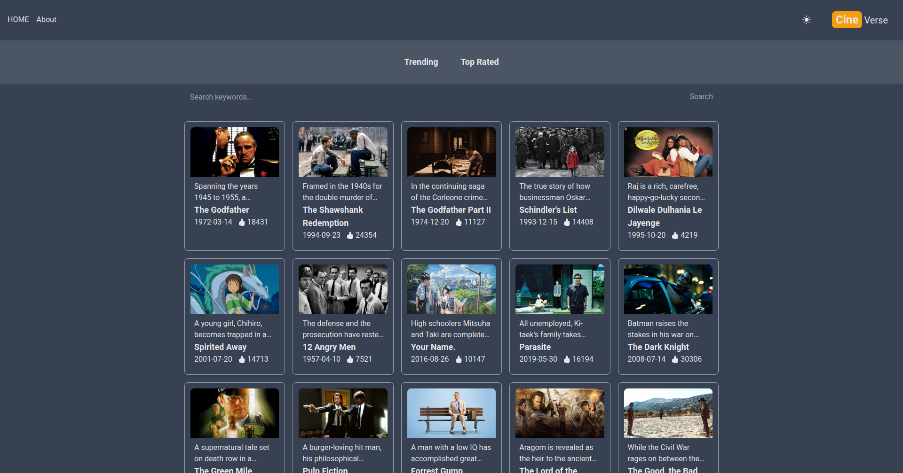
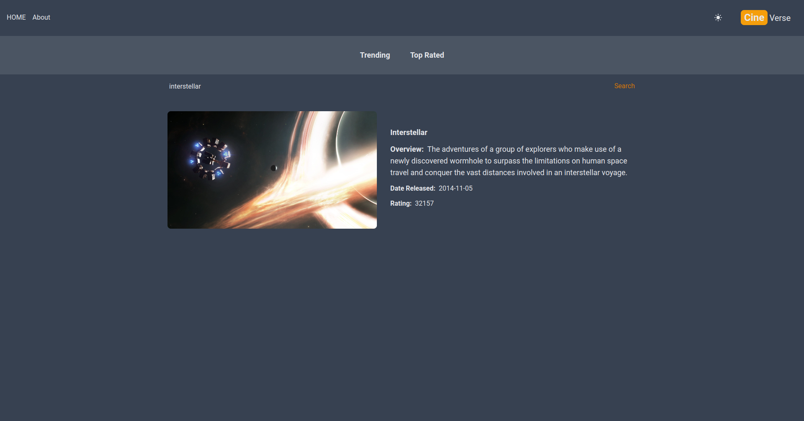

## MY IMDb Project 
# CineVerse: Rewind, Review, React!

Welcome to **CineVerse** – where movie magic comes alive! This web application takes you on a journey through the world of cinema, replicating some of the functionalities of the popular IMDb website. Built using Next.js and Tailwind CSS, and powered by the TMDb API, CineVerse is your gateway to an immersive movie experience. Join us as a contributor and help shape the future of cinematic exploration!

## Table of Contents

- [Project Overview](#project-overview)
- [Features](#features)
- [Screenshots](#screenshots)
- [Getting Started](#getting-started)
- [Contributing](#contributing)
- [Future Plans](#future-plans)
- [Contact](#contact)

## Project Overview

CineVerse is more than just a clone; it's a dynamic web application designed to provide users with a comprehensive database of movies, TV shows, and related content. Through the seamless integration of Next.js, Tailwind CSS, and the TMDb API, we've curated an intuitive platform that allows you to browse, search, and delve into your favorite movies and shows.

## Features

- Explore an extensive collection of movies and TV shows.
- Search for specific movies, TV shows, and actors.
- Access in-depth details about movies, including ratings, cast, and summaries.
- Get personalized recommendations based on your viewing history.
- Enjoy a user-friendly, responsive design for seamless browsing across devices.

## Screenshots

Explore some sneak peeks from the CineVerse experience:

_Showcasing popular movies on the homepage._

_Dive into detailed information about a selected movie._

## Getting Started

Ready to embark on your cinematic adventure? Here's how to get started:

1. Clone the repository: `git clone https://github.com/your-username/cineverse.git`
2. Navigate to the project directory: `cd cineverse`
3. Install dependencies: `npm install`
4. Create a `.env.local` file in the project root and add your TMDb API key:

NEXT_PUBLIC_TMDB_API_KEY=your-api-key

5. Start the development server: `npm run dev`
6. Open your web browser and navigate to `http://localhost:3000`

## Contributing

We embrace contributions from developers of all levels. Whether you're interested in fixing a bug, adding new features, or improving documentation, your involvement is invaluable. Feel free to open issues, submit pull requests, and join our mission to enhance the cinematic experience for all.

## Future Plans

As we journey forward, the vision for CineVerse unfolds:

- Introducing a messenger feature for enriched movie discussions and sharing.
- Enhancing the search functionality to deliver more precise and relevant results.
- Implementing user accounts and personalized watchlists.
- Expanding content to include comprehensive TV show details.
- Elevating the user experience through design refinement.
- Unveiling our unique feature: **"CineVerse: Rewind, Review, React!"** Engage with our distinctive approach to movie ratings and reviews, where every interaction enhances your cinematic journey.

Stay connected as we continue to craft and refine the future of CineVerse!

## Contact

If you have any questions, suggestions, or just want to say hi, you can reach out to us at [hawk.azizi1@gmail.com] LinkedIn: (www.linkedin.com/in/hawkazizi). We're excited to connect with fellow movie enthusiasts and developers!

## 🙌 **Special Acknowledgment:**

A big thank you to the creator of the base code for this project, Mr. Sahand Ghavidel. He's also a fantastic educator with great courses on Udemy that you should definitely check out for further learning!
you should definitely check it out: 👇️

https://www.udemy.com/user/sahand-ghavidel/
